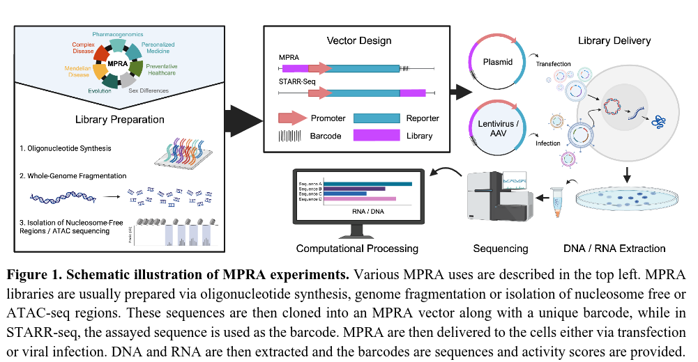

MPRAbase

The rapid decline in synthesis and sequencing costs coupled with advances in reporter assay experimentation have enabled to functionally test the regulatory activity of millions of sequences. This is done using massively parallel reporter assays (MPRAs) that can test the regulatory activity of thousands of sequences in parallel by placing them in front of a transcribed barcode or using the assayed sequence as the barcode (STARR-seq). MPRAbase is a comprehensive, easily accessible database whose goal is to store published MPRA datasets, process them, present them in a user-friendly manner, provide easy to use search tools and rapidly download these datasets. MPRAbase is being continuously updated with results from newly published experiments. If you would like to suggest a new dataset to be included in MPRAbase please contact nadav.ahituv@ucsf.edu.
